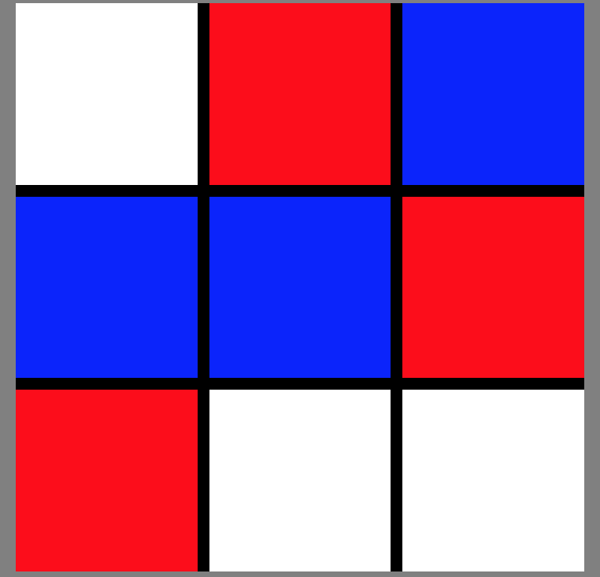

## TIC TAC TOE  
______

## Deployed URL 
https://cpassafaro.github.io/Tic-Tac-Toe/index.html

## How to play
Simple tic tac toe game for two players. Simply click the box you would like to claim and it will light up. Players alternate terms and are able to see either their blue or red color. The winning player is logged to the console.

## Project Description
Javascript is the language used to build this game in conjuction with HTML and CSS.

## Sample
***

## To Be Worked On
Would like to stop game when the winner is declared and present a modal that asks whether they want to play again or not.
